# Extracted Specification: Case System for Firm SJM Pvt. Ltd.

> Source: `Case20System20for20Firm20SJM20Pvt_20Ltd.pdf`  
> Total Pages: 33  
> Embedded Images Extracted: 41

---

## Page 1

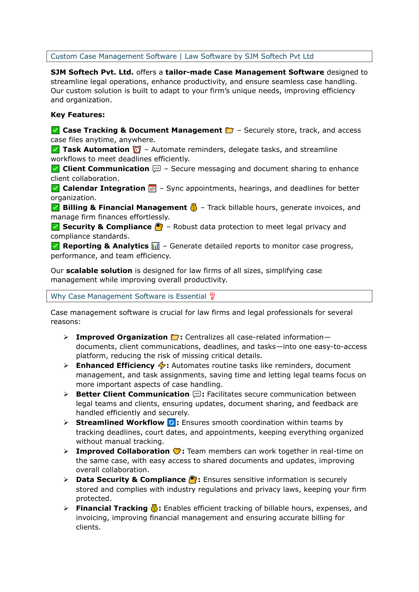

```text
Custom Case Management Software | Law Software by SJM Softech Pvt Ltd 
SJM Softech Pvt. Ltd. offers a tailor-made Case Management Software designed to 
streamline legal operations, enhance productivity, and ensure seamless case handling. 
Our custom solution is built to adapt to your firm’s unique needs, improving efficiency 
and organization. 
Key Features: 
 
 Case Tracking & Document Management  
 – Securely store, track, and access 
case files anytime, anywhere. 
 
 Task Automation  
 – Automate reminders, delegate tasks, and streamline 
workflows to meet deadlines efficiently. 
 
 Client Communication  
 – Secure messaging and document sharing to enhance 
client collaboration. 
 
 Calendar Integration  
 – Sync appointments, hearings, and deadlines for better 
organization. 
 
 Billing & Financial Management  
 – Track billable hours, generate invoices, and 
manage firm finances effortlessly. 
 
 Security & Compliance  
 – Robust data protection to meet legal privacy and 
compliance standards. 
 
 Reporting & Analytics  
 – Generate detailed reports to monitor case progress, 
performance, and team efficiency. 
Our scalable solution is designed for law firms of all sizes, simplifying case 
management while improving overall productivity. 
Why Case Management Software is Essential ❓ 
Case management software is crucial for law firms and legal professionals for several 
reasons: 
➢ Improved Organization  
: Centralizes all case-related information—
documents, client communications, deadlines, and tasks—into one easy-to-access 
platform, reducing the risk of missing critical details. 
➢ Enhanced Efficiency  
: Automates routine tasks like reminders, document 
management, and task assignments, saving time and letting legal teams focus on 
more important aspects of case handling. 
➢ Better Client Communication  
: Facilitates secure communication between 
legal teams and clients, ensuring updates, document sharing, and feedback are 
handled efficiently and securely. 
➢ Streamlined Workflow  
: Ensures smooth coordination within teams by 
tracking deadlines, court dates, and appointments, keeping everything organized 
without manual tracking. 
➢ Improved Collaboration  
: Team members can work together in real-time on 
the same case, with easy access to shared documents and updates, improving 
overall collaboration. 
➢ Data Security & Compliance  
: Ensures sensitive information is securely 
stored and complies with industry regulations and privacy laws, keeping your firm 
protected. 
➢ Financial Tracking  
: Enables efficient tracking of billable hours, expenses, and 
invoicing, improving financial management and ensuring accurate billing for 
clients.
```

---

## Page 2

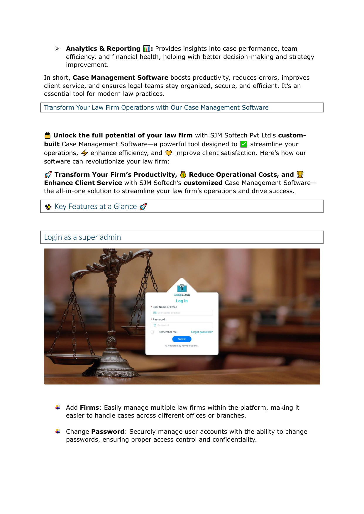

```text
➢ Analytics & Reporting  
: Provides insights into case performance, team 
efficiency, and financial health, helping with better decision-making and strategy 
improvement. 
In short, Case Management Software boosts productivity, reduces errors, improves 
client service, and ensures legal teams stay organized, secure, and efficient. It’s an 
essential tool for modern law practices. 
Transform Your Law Firm Operations with Our Case Management Software 
 
 
 Unlock the full potential of your law firm with SJM Softech Pvt Ltd's custom-
built Case Management Software—a powerful tool designed to  
 streamline your 
operations,  
 enhance efficiency, and  
 improve client satisfaction. Here’s how our 
software can revolutionize your law firm: 
 
 Transform Your Firm’s Productivity,  
 Reduce Operational Costs, and  
 
Enhance Client Service with SJM Softech’s customized Case Management Software—
the all-in-one solution to streamline your law firm’s operations and drive success. 
 
 Key Features at a Glance  
 
 
Login as a super admin  
 
 
 Add Firms: Easily manage multiple law firms within the platform, making it 
easier to handle cases across different offices or branches. 
 
 Change Password: Securely manage user accounts with the ability to change 
passwords, ensuring proper access control and confidentiality.
```

---

## Page 3

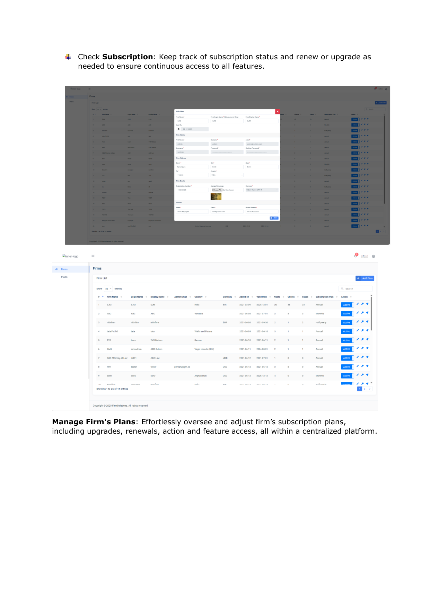

```text
Check Subscription: Keep track of subscription status and renew or upgrade as 
needed to ensure continuous access to all features. 
 
 
 
Manage Firm's Plans: Effortlessly oversee and adjust firm’s subscription plans, 
including upgrades, renewals, action and feature access, all within a centralized platform.
```

---

## Page 4

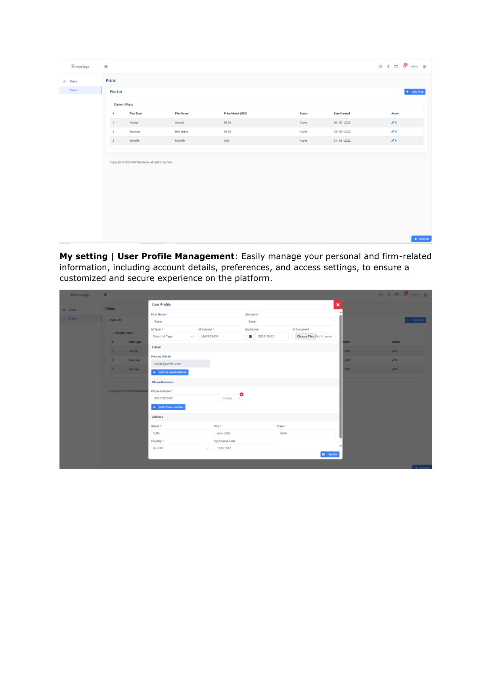

```text
My setting | User Profile Management: Easily manage your personal and firm-related 
information, including account details, preferences, and access settings, to ensure a 
customized and secure experience on the platform.
```

---

## Page 5

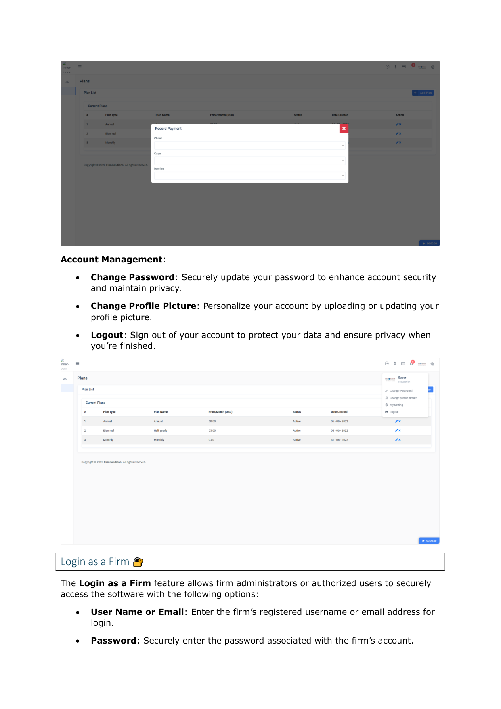

```text
Account Management: 
• 
Change Password: Securely update your password to enhance account security 
and maintain privacy. 
• 
Change Profile Picture: Personalize your account by uploading or updating your 
profile picture. 
• 
Logout: Sign out of your account to protect your data and ensure privacy when 
you’re finished. 
 
Login as a Firm  
 
The Login as a Firm feature allows firm administrators or authorized users to securely 
access the software with the following options: 
• 
User Name or Email: Enter the firm’s registered username or email address for 
login. 
• 
Password: Securely enter the password associated with the firm’s account.
```

---

## Page 6

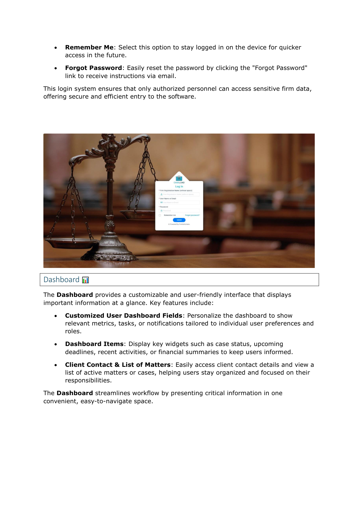

```text
• 
Remember Me: Select this option to stay logged in on the device for quicker 
access in the future. 
• 
Forgot Password: Easily reset the password by clicking the "Forgot Password" 
link to receive instructions via email. 
This login system ensures that only authorized personnel can access sensitive firm data, 
offering secure and efficient entry to the software. 
 
 
 
 
Dashboard  
 
The Dashboard provides a customizable and user-friendly interface that displays 
important information at a glance. Key features include: 
• 
Customized User Dashboard Fields: Personalize the dashboard to show 
relevant metrics, tasks, or notifications tailored to individual user preferences and 
roles. 
• 
Dashboard Items: Display key widgets such as case status, upcoming 
deadlines, recent activities, or financial summaries to keep users informed. 
• 
Client Contact & List of Matters: Easily access client contact details and view a 
list of active matters or cases, helping users stay organized and focused on their 
responsibilities. 
The Dashboard streamlines workflow by presenting critical information in one 
convenient, easy-to-navigate space.
```

---

## Page 7

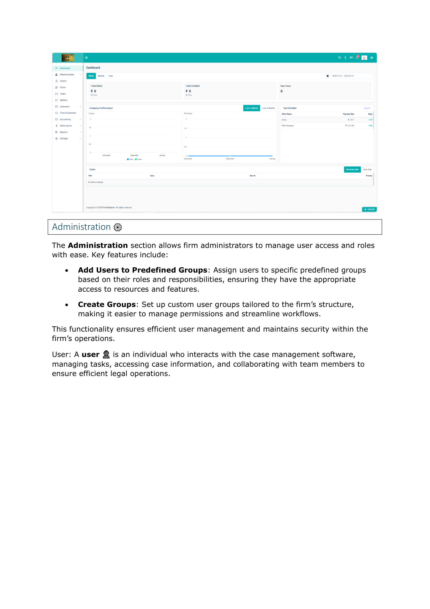

```text
Administration  
 
The Administration section allows firm administrators to manage user access and roles 
with ease. Key features include: 
• 
Add Users to Predefined Groups: Assign users to specific predefined groups 
based on their roles and responsibilities, ensuring they have the appropriate 
access to resources and features. 
• 
Create Groups: Set up custom user groups tailored to the firm’s structure, 
making it easier to manage permissions and streamline workflows. 
This functionality ensures efficient user management and maintains security within the 
firm’s operations. 
User: A user  
 is an individual who interacts with the case management software, 
managing tasks, accessing case information, and collaborating with team members to 
ensure efficient legal operations.
```

---

## Page 8

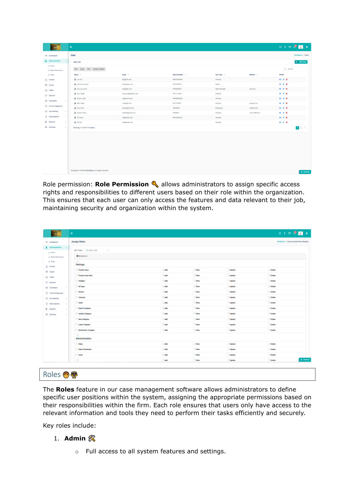

```text
Role permission: Role Permission  
 allows administrators to assign specific access 
rights and responsibilities to different users based on their role within the organization. 
This ensures that each user can only access the features and data relevant to their job, 
maintaining security and organization within the system. 
 
 
Roles  
 
 
The Roles feature in our case management software allows administrators to define 
specific user positions within the system, assigning the appropriate permissions based on 
their responsibilities within the firm. Each role ensures that users only have access to the 
relevant information and tools they need to perform their tasks efficiently and securely. 
Key roles include: 
1. Admin  
 
o 
Full access to all system features and settings.
```

---

## Page 9

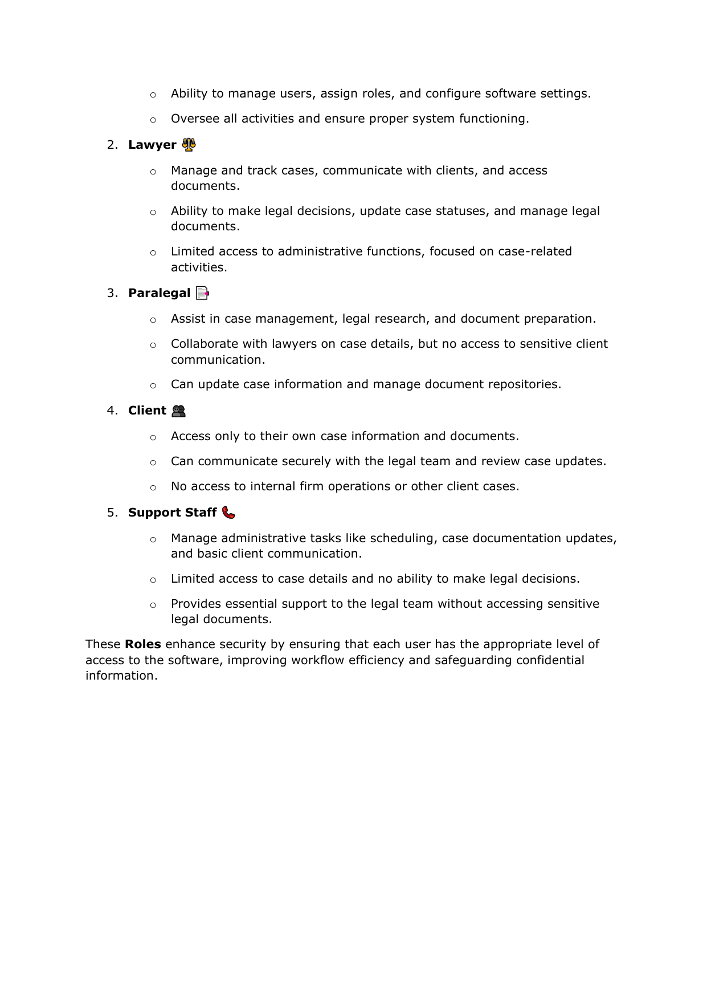

```text
o 
Ability to manage users, assign roles, and configure software settings. 
o 
Oversee all activities and ensure proper system functioning. 
2. Lawyer  
 
o 
Manage and track cases, communicate with clients, and access 
documents. 
o 
Ability to make legal decisions, update case statuses, and manage legal 
documents. 
o 
Limited access to administrative functions, focused on case-related 
activities. 
3. Paralegal  
 
o 
Assist in case management, legal research, and document preparation. 
o 
Collaborate with lawyers on case details, but no access to sensitive client 
communication. 
o 
Can update case information and manage document repositories. 
4. Client  
 
o 
Access only to their own case information and documents. 
o 
Can communicate securely with the legal team and review case updates. 
o 
No access to internal firm operations or other client cases. 
5. Support Staff  
 
o 
Manage administrative tasks like scheduling, case documentation updates, 
and basic client communication. 
o 
Limited access to case details and no ability to make legal decisions. 
o 
Provides essential support to the legal team without accessing sensitive 
legal documents. 
These Roles enhance security by ensuring that each user has the appropriate level of 
access to the software, improving workflow efficiency and safeguarding confidential 
information.
```

---

## Page 10

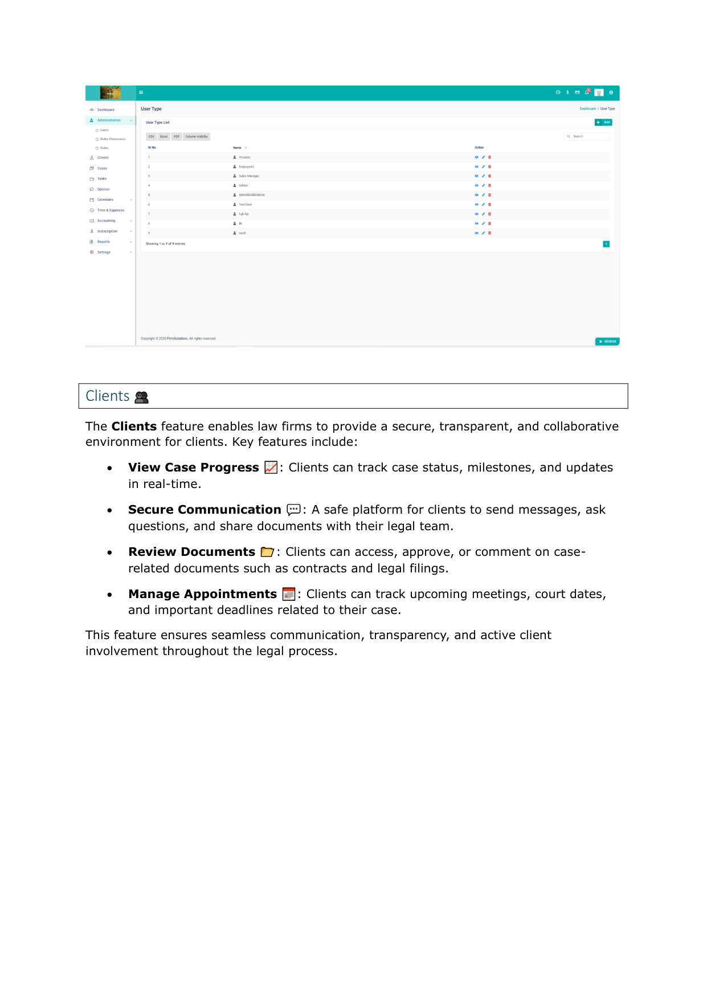

```text
Clients  
 
The Clients feature enables law firms to provide a secure, transparent, and collaborative 
environment for clients. Key features include: 
• 
View Case Progress  
: Clients can track case status, milestones, and updates 
in real-time. 
• 
Secure Communication  
: A safe platform for clients to send messages, ask 
questions, and share documents with their legal team. 
• 
Review Documents  
: Clients can access, approve, or comment on case-
related documents such as contracts and legal filings. 
• 
Manage Appointments  
: Clients can track upcoming meetings, court dates, 
and important deadlines related to their case. 
This feature ensures seamless communication, transparency, and active client 
involvement throughout the legal process.
```

---

## Page 11

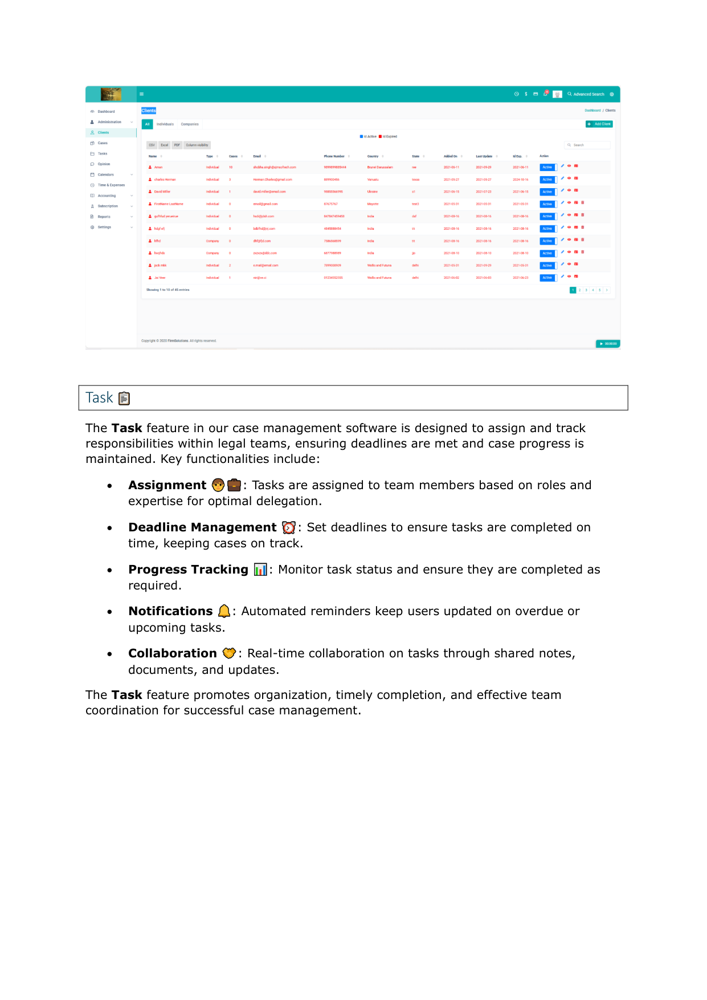

```text
Task  
 
The Task feature in our case management software is designed to assign and track 
responsibilities within legal teams, ensuring deadlines are met and case progress is 
maintained. Key functionalities include: 
• 
Assignment  
 
: Tasks are assigned to team members based on roles and 
expertise for optimal delegation. 
• 
Deadline Management  
: Set deadlines to ensure tasks are completed on 
time, keeping cases on track. 
• 
Progress Tracking  
: Monitor task status and ensure they are completed as 
required. 
• 
Notifications  
: Automated reminders keep users updated on overdue or 
upcoming tasks. 
• 
Collaboration  
: Real-time collaboration on tasks through shared notes, 
documents, and updates. 
The Task feature promotes organization, timely completion, and effective team 
coordination for successful case management.
```

---

## Page 12

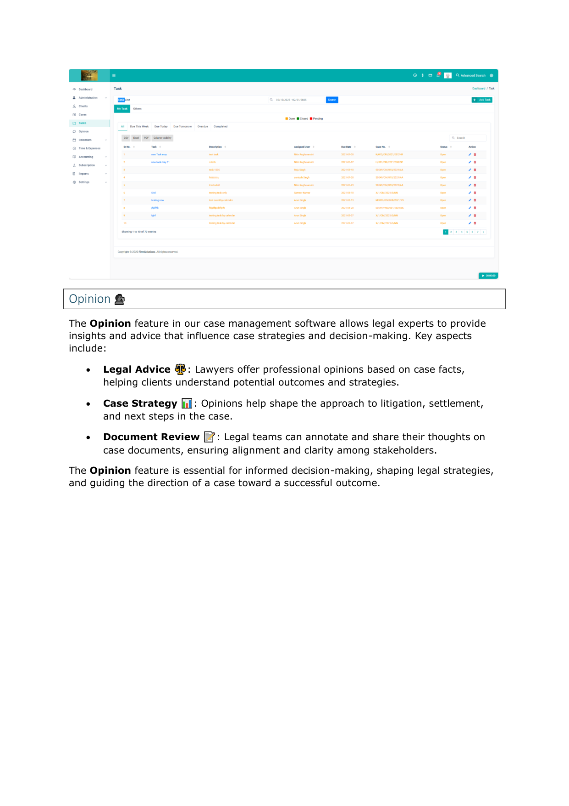

```text
Opinion  
 
The Opinion feature in our case management software allows legal experts to provide 
insights and advice that influence case strategies and decision-making. Key aspects 
include: 
• 
Legal Advice  
: Lawyers offer professional opinions based on case facts, 
helping clients understand potential outcomes and strategies. 
• 
Case Strategy  
: Opinions help shape the approach to litigation, settlement, 
and next steps in the case. 
• 
Document Review  
: Legal teams can annotate and share their thoughts on 
case documents, ensuring alignment and clarity among stakeholders. 
The Opinion feature is essential for informed decision-making, shaping legal strategies, 
and guiding the direction of a case toward a successful outcome.
```

---

## Page 13

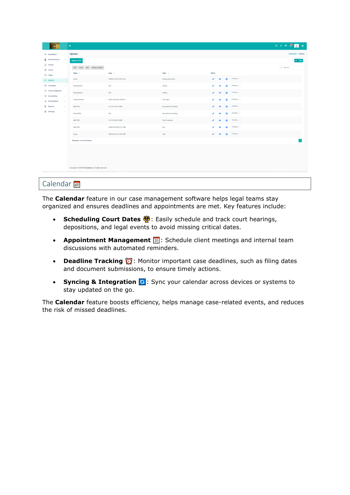

```text
Calendar  
 
The Calendar feature in our case management software helps legal teams stay 
organized and ensures deadlines and appointments are met. Key features include: 
• 
Scheduling Court Dates  
: Easily schedule and track court hearings, 
depositions, and legal events to avoid missing critical dates. 
• 
Appointment Management  
: Schedule client meetings and internal team 
discussions with automated reminders. 
• 
Deadline Tracking  
: Monitor important case deadlines, such as filing dates 
and document submissions, to ensure timely actions. 
• 
Syncing & Integration  
: Sync your calendar across devices or systems to 
stay updated on the go. 
The Calendar feature boosts efficiency, helps manage case-related events, and reduces 
the risk of missed deadlines.
```

---

## Page 14

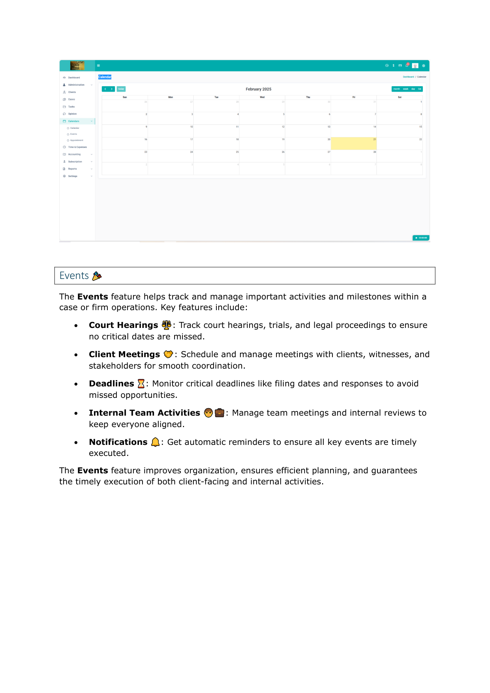

```text
Events  
 
The Events feature helps track and manage important activities and milestones within a 
case or firm operations. Key features include: 
• 
Court Hearings  
: Track court hearings, trials, and legal proceedings to ensure 
no critical dates are missed. 
• 
Client Meetings  
: Schedule and manage meetings with clients, witnesses, and 
stakeholders for smooth coordination. 
• 
Deadlines  
: Monitor critical deadlines like filing dates and responses to avoid 
missed opportunities. 
• 
Internal Team Activities  
 
: Manage team meetings and internal reviews to 
keep everyone aligned. 
• 
Notifications  
: Get automatic reminders to ensure all key events are timely 
executed. 
The Events feature improves organization, ensures efficient planning, and guarantees 
the timely execution of both client-facing and internal activities.
```

---

## Page 15

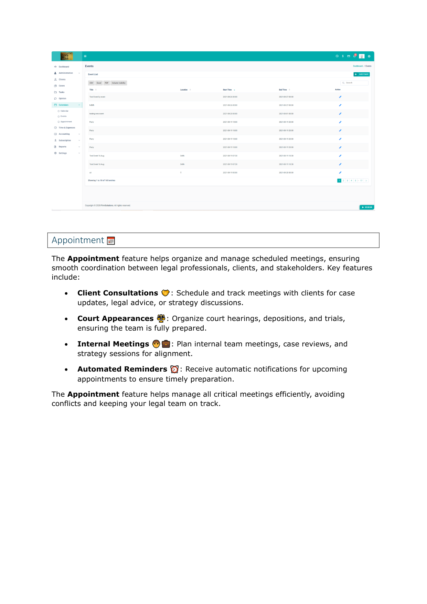

```text
Appointment  
 
The Appointment feature helps organize and manage scheduled meetings, ensuring 
smooth coordination between legal professionals, clients, and stakeholders. Key features 
include: 
• 
Client Consultations  
: Schedule and track meetings with clients for case 
updates, legal advice, or strategy discussions. 
• 
Court Appearances  
: Organize court hearings, depositions, and trials, 
ensuring the team is fully prepared. 
• 
Internal Meetings  
 
: Plan internal team meetings, case reviews, and 
strategy sessions for alignment. 
• 
Automated Reminders  
: Receive automatic notifications for upcoming 
appointments to ensure timely preparation. 
The Appointment feature helps manage all critical meetings efficiently, avoiding 
conflicts and keeping your legal team on track.
```

---

## Page 16

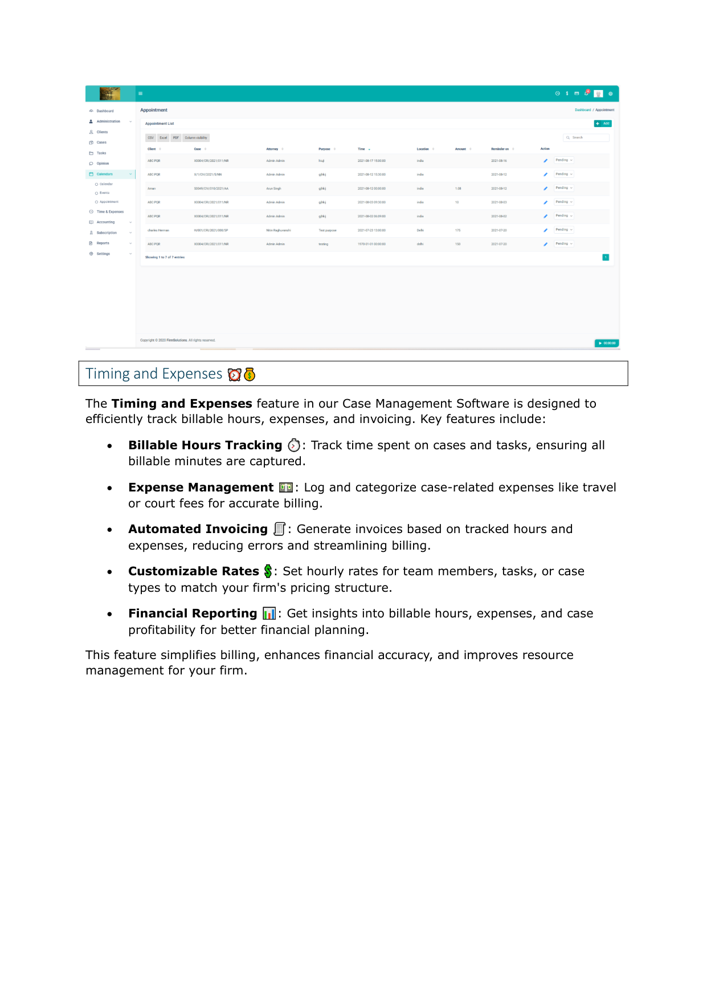

```text
Timing and Expenses  
 
 
The Timing and Expenses feature in our Case Management Software is designed to 
efficiently track billable hours, expenses, and invoicing. Key features include: 
• 
Billable Hours Tracking  
: Track time spent on cases and tasks, ensuring all 
billable minutes are captured. 
• 
Expense Management  
: Log and categorize case-related expenses like travel 
or court fees for accurate billing. 
• 
Automated Invoicing  
: Generate invoices based on tracked hours and 
expenses, reducing errors and streamlining billing. 
• 
Customizable Rates  
: Set hourly rates for team members, tasks, or case 
types to match your firm's pricing structure. 
• 
Financial Reporting  
: Get insights into billable hours, expenses, and case 
profitability for better financial planning. 
This feature simplifies billing, enhances financial accuracy, and improves resource 
management for your firm.
```

---

## Page 17

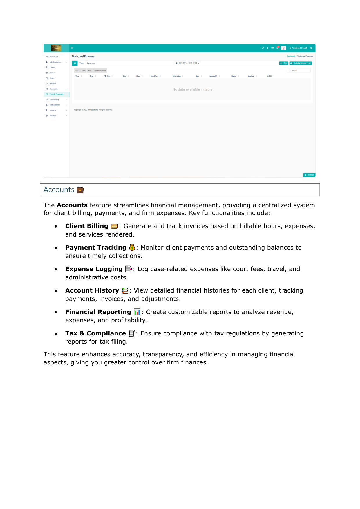

```text
Accounts  
 
The Accounts feature streamlines financial management, providing a centralized system 
for client billing, payments, and firm expenses. Key functionalities include: 
• 
Client Billing  
: Generate and track invoices based on billable hours, expenses, 
and services rendered. 
• 
Payment Tracking  
: Monitor client payments and outstanding balances to 
ensure timely collections. 
• 
Expense Logging  
: Log case-related expenses like court fees, travel, and 
administrative costs. 
• 
Account History  
: View detailed financial histories for each client, tracking 
payments, invoices, and adjustments. 
• 
Financial Reporting  
: Create customizable reports to analyze revenue, 
expenses, and profitability. 
• 
Tax & Compliance  
: Ensure compliance with tax regulations by generating 
reports for tax filing. 
This feature enhances accuracy, transparency, and efficiency in managing financial 
aspects, giving you greater control over firm finances.
```

---

## Page 18

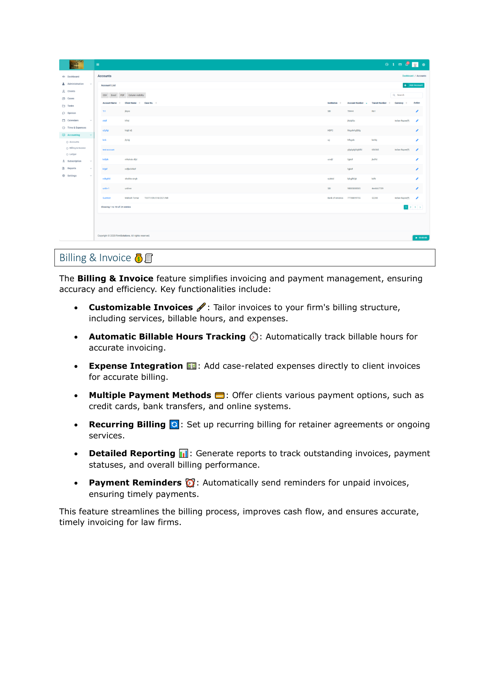

```text
Billing & Invoice  
 
 
The Billing & Invoice feature simplifies invoicing and payment management, ensuring 
accuracy and efficiency. Key functionalities include: 
• 
Customizable Invoices  
: Tailor invoices to your firm's billing structure, 
including services, billable hours, and expenses. 
• 
Automatic Billable Hours Tracking  
: Automatically track billable hours for 
accurate invoicing. 
• 
Expense Integration  
: Add case-related expenses directly to client invoices 
for accurate billing. 
• 
Multiple Payment Methods  
: Offer clients various payment options, such as 
credit cards, bank transfers, and online systems. 
• 
Recurring Billing  
: Set up recurring billing for retainer agreements or ongoing 
services. 
• 
Detailed Reporting  
: Generate reports to track outstanding invoices, payment 
statuses, and overall billing performance. 
• 
Payment Reminders  
: Automatically send reminders for unpaid invoices, 
ensuring timely payments. 
This feature streamlines the billing process, improves cash flow, and ensures accurate, 
timely invoicing for law firms.
```

---

## Page 19

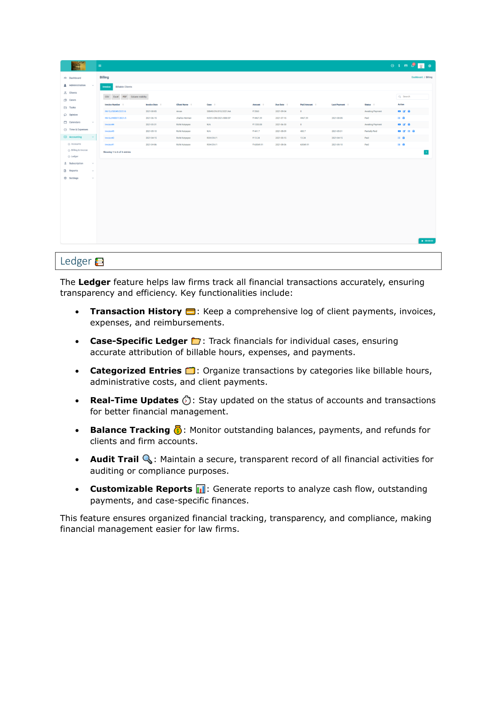

```text
Ledger  
 
The Ledger feature helps law firms track all financial transactions accurately, ensuring 
transparency and efficiency. Key functionalities include: 
• 
Transaction History  
: Keep a comprehensive log of client payments, invoices, 
expenses, and reimbursements. 
• 
Case-Specific Ledger  
: Track financials for individual cases, ensuring 
accurate attribution of billable hours, expenses, and payments. 
• 
Categorized Entries  
: Organize transactions by categories like billable hours, 
administrative costs, and client payments. 
• 
Real-Time Updates  
: Stay updated on the status of accounts and transactions 
for better financial management. 
• 
Balance Tracking  
: Monitor outstanding balances, payments, and refunds for 
clients and firm accounts. 
• 
Audit Trail  
: Maintain a secure, transparent record of all financial activities for 
auditing or compliance purposes. 
• 
Customizable Reports  
: Generate reports to analyze cash flow, outstanding 
payments, and case-specific finances. 
This feature ensures organized financial tracking, transparency, and compliance, making 
financial management easier for law firms.
```

---

## Page 20

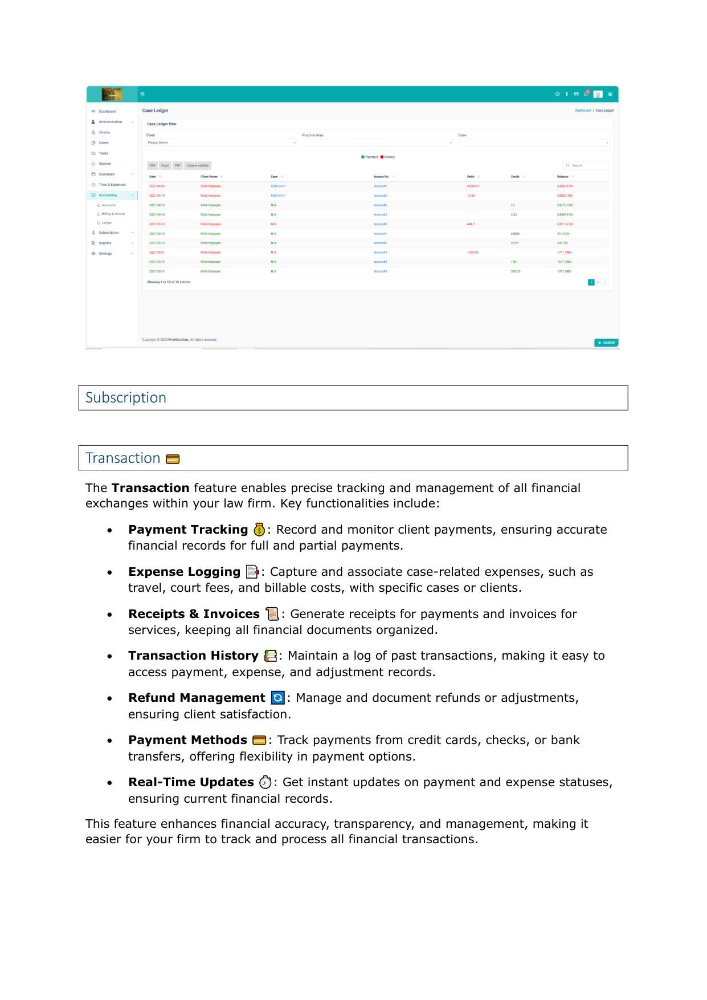

```text
Subscription 
 
Transaction  
 
The Transaction feature enables precise tracking and management of all financial 
exchanges within your law firm. Key functionalities include: 
• 
Payment Tracking  
: Record and monitor client payments, ensuring accurate 
financial records for full and partial payments. 
• 
Expense Logging  
: Capture and associate case-related expenses, such as 
travel, court fees, and billable costs, with specific cases or clients. 
• 
Receipts & Invoices  
: Generate receipts for payments and invoices for 
services, keeping all financial documents organized. 
• 
Transaction History  
: Maintain a log of past transactions, making it easy to 
access payment, expense, and adjustment records. 
• 
Refund Management  
: Manage and document refunds or adjustments, 
ensuring client satisfaction. 
• 
Payment Methods  
: Track payments from credit cards, checks, or bank 
transfers, offering flexibility in payment options. 
• 
Real-Time Updates  
: Get instant updates on payment and expense statuses, 
ensuring current financial records. 
This feature enhances financial accuracy, transparency, and management, making it 
easier for your firm to track and process all financial transactions.
```

---

## Page 21

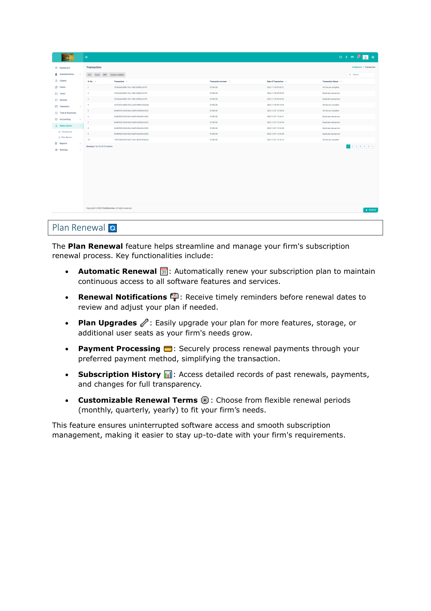

```text
Plan Renewal  
 
The Plan Renewal feature helps streamline and manage your firm's subscription 
renewal process. Key functionalities include: 
• 
Automatic Renewal  
: Automatically renew your subscription plan to maintain 
continuous access to all software features and services. 
• 
Renewal Notifications  
: Receive timely reminders before renewal dates to 
review and adjust your plan if needed. 
• 
Plan Upgrades  
: Easily upgrade your plan for more features, storage, or 
additional user seats as your firm's needs grow. 
• 
Payment Processing  
: Securely process renewal payments through your 
preferred payment method, simplifying the transaction. 
• 
Subscription History  
: Access detailed records of past renewals, payments, 
and changes for full transparency. 
• 
Customizable Renewal Terms  
: Choose from flexible renewal periods 
(monthly, quarterly, yearly) to fit your firm’s needs. 
This feature ensures uninterrupted software access and smooth subscription 
management, making it easier to stay up-to-date with your firm's requirements.
```

---

## Page 22

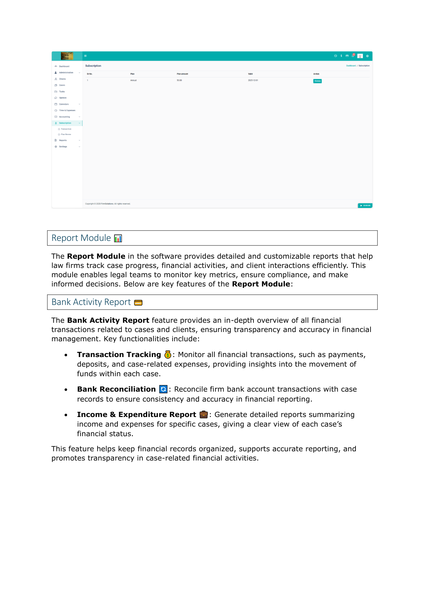

```text
Report Module  
 
The Report Module in the software provides detailed and customizable reports that help 
law firms track case progress, financial activities, and client interactions efficiently. This 
module enables legal teams to monitor key metrics, ensure compliance, and make 
informed decisions. Below are key features of the Report Module: 
Bank Activity Report  
 
The Bank Activity Report feature provides an in-depth overview of all financial 
transactions related to cases and clients, ensuring transparency and accuracy in financial 
management. Key functionalities include: 
• 
Transaction Tracking  
: Monitor all financial transactions, such as payments, 
deposits, and case-related expenses, providing insights into the movement of 
funds within each case. 
• 
Bank Reconciliation  
: Reconcile firm bank account transactions with case 
records to ensure consistency and accuracy in financial reporting. 
• 
Income & Expenditure Report  
: Generate detailed reports summarizing 
income and expenses for specific cases, giving a clear view of each case’s 
financial status. 
This feature helps keep financial records organized, supports accurate reporting, and 
promotes transparency in case-related financial activities.
```

---

## Page 23

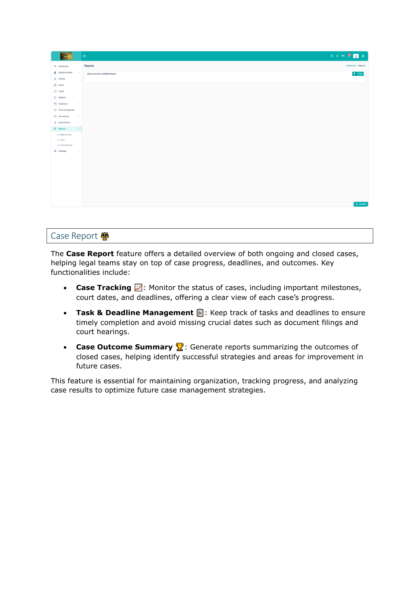

```text
Case Report  
 
The Case Report feature offers a detailed overview of both ongoing and closed cases, 
helping legal teams stay on top of case progress, deadlines, and outcomes. Key 
functionalities include: 
• 
Case Tracking  
: Monitor the status of cases, including important milestones, 
court dates, and deadlines, offering a clear view of each case’s progress. 
• 
Task & Deadline Management  
: Keep track of tasks and deadlines to ensure 
timely completion and avoid missing crucial dates such as document filings and 
court hearings. 
• 
Case Outcome Summary  
: Generate reports summarizing the outcomes of 
closed cases, helping identify successful strategies and areas for improvement in 
future cases. 
This feature is essential for maintaining organization, tracking progress, and analyzing 
case results to optimize future case management strategies.
```

---

## Page 24

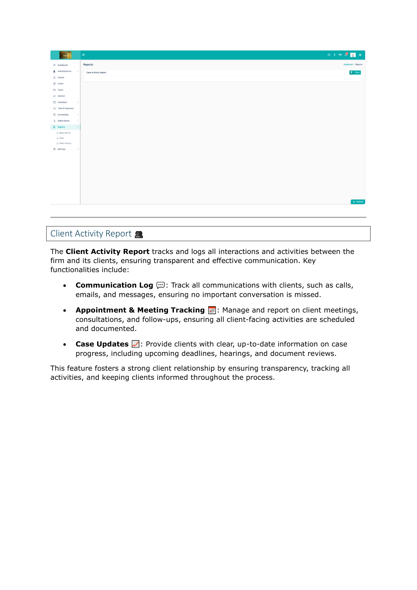

```text
Client Activity Report  
 
The Client Activity Report tracks and logs all interactions and activities between the 
firm and its clients, ensuring transparent and effective communication. Key 
functionalities include: 
• 
Communication Log  
: Track all communications with clients, such as calls, 
emails, and messages, ensuring no important conversation is missed. 
• 
Appointment & Meeting Tracking  
: Manage and report on client meetings, 
consultations, and follow-ups, ensuring all client-facing activities are scheduled 
and documented. 
• 
Case Updates  
: Provide clients with clear, up-to-date information on case 
progress, including upcoming deadlines, hearings, and document reviews. 
This feature fosters a strong client relationship by ensuring transparency, tracking all 
activities, and keeping clients informed throughout the process.
```

---

## Page 25

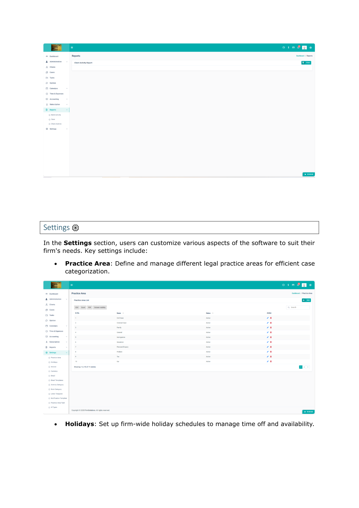

```text
Settings  
 
In the Settings section, users can customize various aspects of the software to suit their 
firm's needs. Key settings include: 
• 
Practice Area: Define and manage different legal practice areas for efficient case 
categorization. 
 
• 
Holidays: Set up firm-wide holiday schedules to manage time off and availability.
```

---

## Page 26

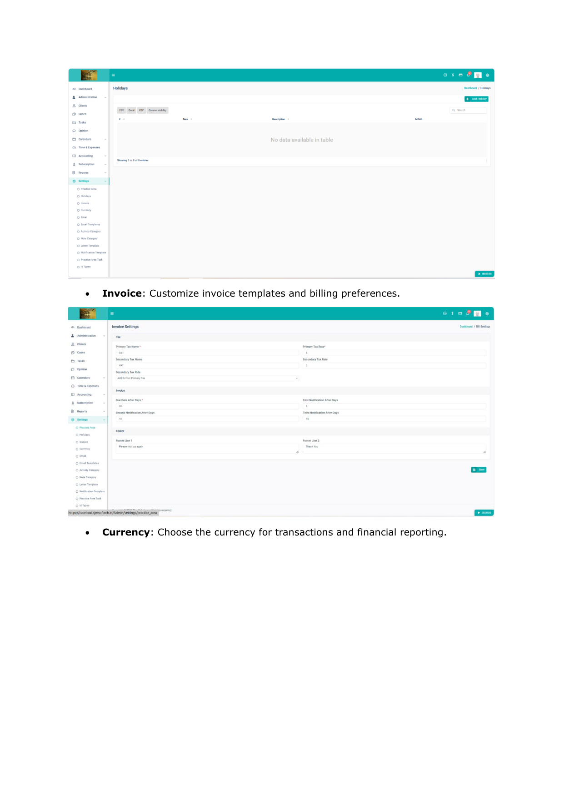

```text
• 
Invoice: Customize invoice templates and billing preferences. 
 
• 
Currency: Choose the currency for transactions and financial reporting.
```

---

## Page 27

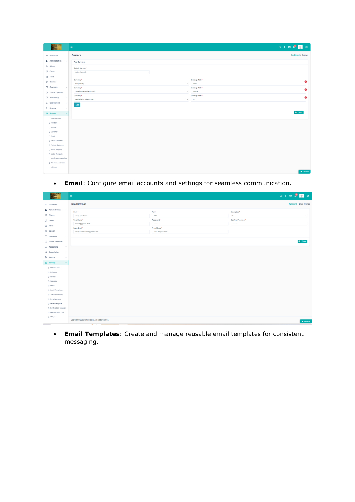

```text
• 
Email: Configure email accounts and settings for seamless communication. 
 
• 
Email Templates: Create and manage reusable email templates for consistent 
messaging.
```

---

## Page 28

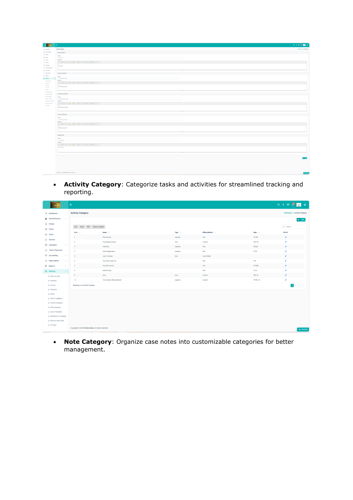

```text
• 
Activity Category: Categorize tasks and activities for streamlined tracking and 
reporting. 
 
• 
Note Category: Organize case notes into customizable categories for better 
management.
```

---

## Page 29

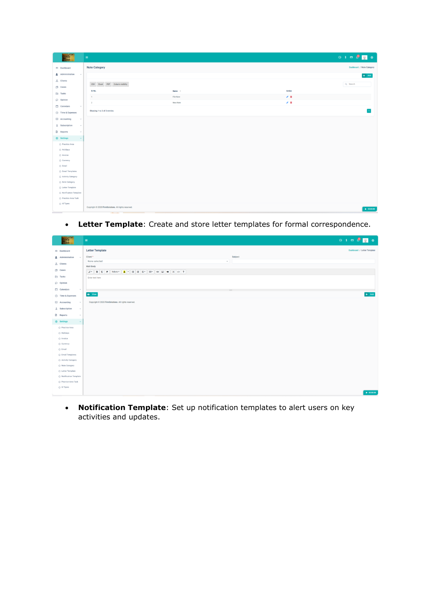

```text
• 
Letter Template: Create and store letter templates for formal correspondence. 
 
• 
Notification Template: Set up notification templates to alert users on key 
activities and updates.
```

---

## Page 30

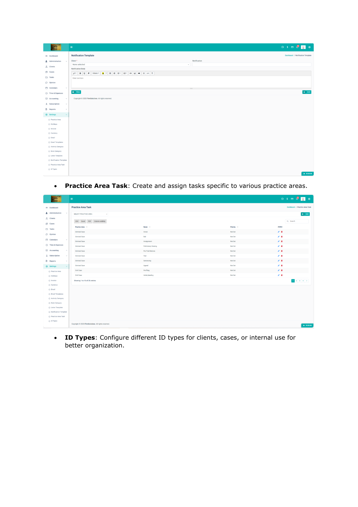

```text
• 
Practice Area Task: Create and assign tasks specific to various practice areas. 
 
• 
ID Types: Configure different ID types for clients, cases, or internal use for 
better organization.
```

---

## Page 31

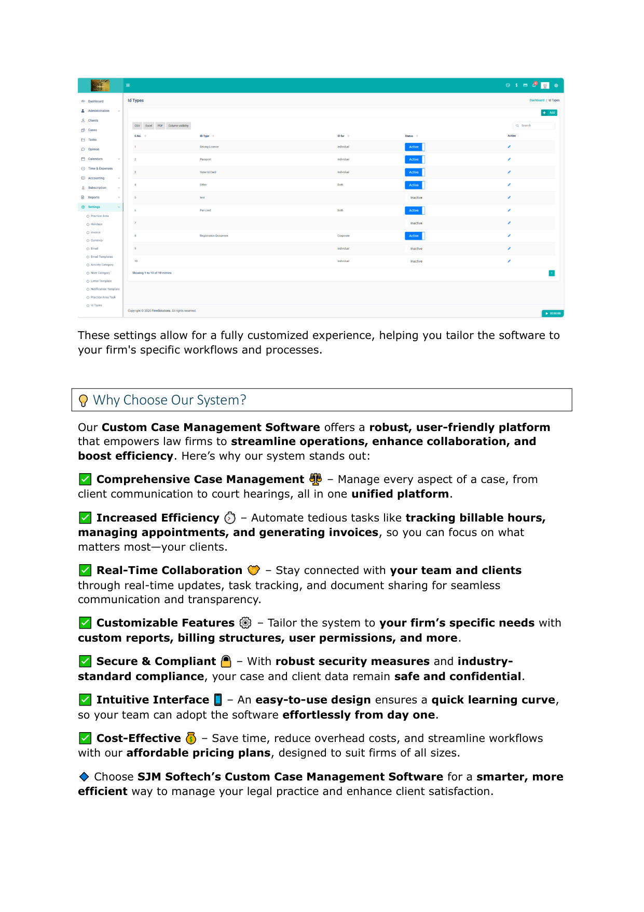

```text
These settings allow for a fully customized experience, helping you tailor the software to 
your firm's specific workflows and processes. 
 
 
 Why Choose Our System? 
Our Custom Case Management Software offers a robust, user-friendly platform 
that empowers law firms to streamline operations, enhance collaboration, and 
boost efficiency. Here’s why our system stands out: 
 
 Comprehensive Case Management  
 – Manage every aspect of a case, from 
client communication to court hearings, all in one unified platform. 
 
 Increased Efficiency  
 – Automate tedious tasks like tracking billable hours, 
managing appointments, and generating invoices, so you can focus on what 
matters most—your clients. 
 
 Real-Time Collaboration  
 – Stay connected with your team and clients 
through real-time updates, task tracking, and document sharing for seamless 
communication and transparency. 
 
 Customizable Features  
 – Tailor the system to your firm’s specific needs with 
custom reports, billing structures, user permissions, and more. 
 
 Secure & Compliant  
 – With robust security measures and industry-
standard compliance, your case and client data remain safe and confidential. 
 
 Intuitive Interface  
 – An easy-to-use design ensures a quick learning curve, 
so your team can adopt the software effortlessly from day one. 
 
 Cost-Effective  
 – Save time, reduce overhead costs, and streamline workflows 
with our affordable pricing plans, designed to suit firms of all sizes. 
 
 Choose SJM Softech’s Custom Case Management Software for a smarter, more 
efficient way to manage your legal practice and enhance client satisfaction.
```

---

## Page 32

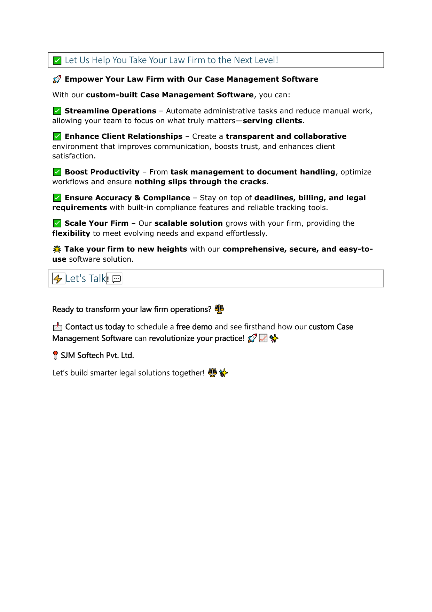

```text
Let Us Help You Take Your Law Firm to the Next Level! 
 
 Empower Your Law Firm with Our Case Management Software 
With our custom-built Case Management Software, you can: 
 
 Streamline Operations – Automate administrative tasks and reduce manual work, 
allowing your team to focus on what truly matters—serving clients. 
 
 Enhance Client Relationships – Create a transparent and collaborative 
environment that improves communication, boosts trust, and enhances client 
satisfaction. 
 
 Boost Productivity – From task management to document handling, optimize 
workflows and ensure nothing slips through the cracks. 
 
 Ensure Accuracy & Compliance – Stay on top of deadlines, billing, and legal 
requirements with built-in compliance features and reliable tracking tools. 
 
 Scale Your Firm – Our scalable solution grows with your firm, providing the 
flexibility to meet evolving needs and expand effortlessly. 
 
 Take your firm to new heights with our comprehensive, secure, and easy-to-
use software solution. 
 
 Let's Talk!  
 
 
Ready to transform your law firm operations?  
 
 
 Contact us today to schedule a free demo and see firsthand how our custom Case 
Management Software can revolutionize your practice!  
 
 
 
 
 SJM Softech Pvt. Ltd. 
Let’s build smarter legal solutions together!
```

---

## Page 33


```text
[No text on this page or visual diagram only]
```

---

